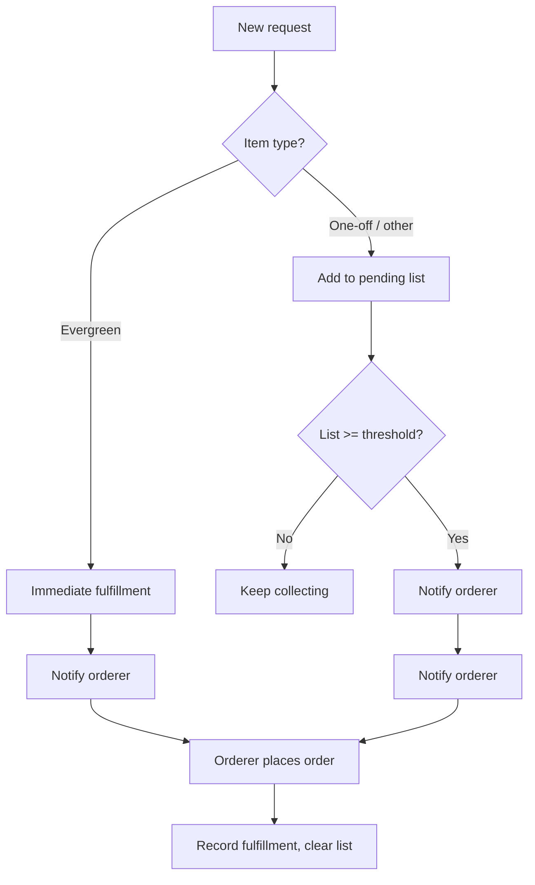

# SLOP (Shopping List Ordering Platform) – Product & Technical Plan (v3)

## 1. Problem Statement (BA / Product)

**Current pain**
- Office inventory depletes constantly; requests are ad-hoc in Slack.
- Mix of **evergreen** items (coffee, milk) and **one-offs** (chocolate bars, nuts, drinks, yogurts).
- The person who places the order loses items in the noise, duplicates work, and has no single place to see "what to order."

**Goals**
- One place to see **what's needed** and **what's already requested**.
- **No inventory tracking** – app is request-driven only (people request; system decides when to trigger an order).
- **Smart fulfillment**:
  - **Evergreen / staples** (e.g. milk, coffee): as soon as someone adds such an item → **immediate fulfillment** (orderer notified to place order right away).
  - **Other items** (e.g. chocolate bars, nuts, drinks): requests accumulate on a list; when the list hits a **fulfillment threshold** (e.g. N items) → orderer gets notified to place an order.
- **Slack integration** for adding requests and notifications (V2+).

**Success (MVP)**
- Orderer gets notified only when it's time to act: either "staple requested – order now" or "list hit threshold – place order."
- Colleagues add requests without writing free text in Slack; no manual opening/closing of cycles.

---

## 2. Fulfillment Model (Core Behavior)

**No inventory, no manual cycles.** Two trigger types:

| Trigger type | When it fires | Example |
|--------------|----------------|--------|
| **Immediate** | As soon as a request is added for an item marked **evergreen/staple** | Milk, coffee, bread – "we're out, order now." |
| **Threshold** | When the **list** (non-evergreen items) reaches a configurable threshold | e.g. 5 items – then "list ready, place order." |

**Flow**
1. Colleague adds a request (e.g. "milk" or "chocolate bars").
2. **If item is evergreen** → add to list (if not already on it); orderer is notified immediately.
3. **If item is not evergreen** → add to list (if not already on it). When list size hits threshold → orderer is notified.
4. Orderer "fulfills" (places order with supplier or in store, marks as done): a fulfillment record is created in the DB with auto datetime; the list is cleared for the next order.

**One shared list**  
Only one instance of each product can be on the list; everyone sees the same items. No batching window.

---

## 3. Domain Model (Bounded Contexts)

| Subdomain | Responsibility | Key concepts |
|-----------|----------------|--------------|
| **Catalog** | What can be ordered | Item (name, category, **is_evergreen** vs one-off) |
| **Requests** | What people want | Request (item, requester, **status**: pending / in_fulfillment / fulfilled); no quantity or notes—orderer decides quantity when ordering |
| **Fulfillment** | When orderer is notified and order history | Fulfillment (trigger: immediate \| threshold, list of requests, **fulfilled_at** auto datetime); **FulfillmentThreshold** (min_pending_items only) |
| **Notifications** | Notify orderer | "Immediate: order milk, coffee" or "Threshold reached: here's the list" (Slack: later) |

**No** inventory subdomain; **no** order cycles – replaced by **Fulfillment** and **FulfillmentThreshold**.

---

## 4. User Roles & Flows

- **Colleague**: Add/cancel requests (no view of own requests).
- **Orderer**: See the order list; clear the list when they have placed the order (in another app or in store); manage catalog (evergreen vs one-off) and **fulfillment threshold**; view past orders in admin panel.

**Key flows**
1. **Request something**  
   Colleague picks item (or adds one-off). Item is added to the single shared list (one instance per product).  
   - Evergreen → orderer notified immediately.  
   - Non-evergreen → when list size hits threshold, orderer notified.
2. **Orderer opens app**  
   Sees the single order list (empty or with items) and, if applicable, count until threshold ("3/5 items until next batch").
3. **Orderer fulfills**  
   Marks the list as ordered: a fulfillment record is created in the DB with auto datetime. List is cleared for the next order.
4. **Catalog & settings**  
   Orderer sets items as evergreen or not; sets threshold (e.g. 5 items). Orderer can view past orders (fulfillment history) in admin panel.

---

## 5. Design & UX Direction

**UX concept**

- **Single central list** – There is only one order list. It is either empty or has items; no "pending" or "current" state. Orderer clears the list when they have placed the order (in another app or in store).
- **Products as cards** – Catalog items are shown as cards in a loose, "tossed" or spatial layout around (or beside) the list.
- **Add to list** – User picks a product card (click or drag) and adds it to the central list.
- **Omnisearch** – If a product is not found, user can search globally or create a new product from the same tool (find-or-create).
- **Fulfill → scatter** – When the orderer marks the list as fulfilled, the list clears and products visually "scatter" back (animation) into the product space, leaving the list empty for the next order.

**Stylistic inspiration: Blinkit**

[Blinkit](https://blinkit.com/) is the primary **visual and design-system reference** for SLOP. Use it for look-and-feel, not for product flows.

- **Design system**: **Lambda** (internally also “Bolt”). Documented at [Lambda by Blinkit](https://lambda.blinkit.com/) (e.g. [Why build a Design System?](https://lambda.blinkit.com/why-build-a-design-system-faa4285f897e)). Community Figma: [Blinkit-UI](https://www.figma.com/community/file/1481577847723242789/blinkit-ui).
- **Philosophy**: Clean and simple interface; customer is the focus; seamless, fast experience. “Immaculate and fresh feeling.”
- **Palette**: **Bright yellow and black** – high visibility, instant recognition (app, delivery, digital). Use yellow as primary accent and black for text/UI; keep palette limited and bold.
- **Typography**: **Gilroy** – geometric, clear, modern; good readability and a fresh feel. Use a similar geometric sans if Gilroy is not licensed.
- **Structure**: Atomic Design – **Constants** (fonts, colors, shadows, spacing, icons) → **Elements** (buttons, inputs, links, tags) → **Components** (search, forms, etc.) → **Widgets** → **Pages**. Define constants first; build elements and components from them.
- **Principles to borrow**: Single source of truth for tokens; clean hierarchy; speed and clarity over decoration.

**Interaction and layout inspiration (simple but beautiful)**

| Area | Products to reference | What to borrow |
|------|------------------------|----------------|
| **Layout & spatial metaphor** | Miro, FigJam, Apple Freeform | Infinite canvas, one central zone (the list), cards/stickies elsewhere; clean, minimal. |
| **List + product cards** | Trello | One column = order list, rest of board = catalog cards; drag card into list. |
| **"Market" and reset** | Marvel Snap, Slay the Spire | Shop/market of cards; add to list; on fulfill, "market" resets / list clears with clear metaphor. |
| **Omnisearch (find or create)** | Linear, Raycast, Notion | Single command/search that finds existing or creates new (e.g. product). |

**Principles**

- Simple, uncluttered layout; one list, one product space.
- Delight in the fulfill moment: visible reset (scatter-back) so the next order feels like a fresh start.
- **Visual style**: Blinkit-inspired – bold yellow/black, geometric sans, token-based constants, clean and fast.

---

## 6. Scope: In / Out of Scope

**In scope (MVP)**
- Catalog: items with **is_evergreen** (and name, category).
- Requests: item, requester, status; linked to fulfillment when triggered. No notes or quantity—orderer decides quantity when placing the order.
- **Fulfillment**: trigger type (immediate vs threshold), status (pending/fulfilled), list of requests; orderer marks as fulfilled (record in DB with auto datetime).
- **Fulfillment threshold**: configurable (e.g. "notify when N items" on the list); min_pending_items only.
- One shared list: only one instance of each product can be on the list; everyone sees the same items. No batching window.
- Simple auth and role: orderer vs colleague.
- Slack: later (V2+).

**Out of scope (MVP)**
- **Inventory tracking** (stock levels, shelves) – app works without it.
- Manual "order cycles" (open/close week by week).
- Approvals, budgets, cost tracking.
- Multi-office.

**Later (V2+)**
- Recurring "evergreen" suggestions (e.g. "milk every Monday").
- Export list (CSV/PDF).
- Slack: add request, notify orderer on fulfillment, "What's on the list?" query.

---

## 7. Data Model (Minimal)

- **Items**: id, name, category, **is_evergreen**, created_at.
- **Requests**: id, item_id, requester_id (or email), status (pending \| in_fulfillment \| fulfilled), **fulfillment_id** (nullable), created_at. No quantity or notes; orderer decides quantity when ordering.
- **Fulfillments**: id, trigger (immediate \| threshold), status (pending \| fulfilled), **fulfilled_at** (auto datetime when orderer marks as ordered), created_at. (Requests reference fulfillment_id.)
- **FulfillmentThreshold** (or settings): **min_pending_items** only (e.g. 5)—orderer is notified when the number of distinct items on the list reaches this value. Orderer can change it. No “min requesters” in MVP.
- **Users**: id, email, role (orderer \| colleague).

**Logic**
- On new request: add item to the single shared list (one instance per product). If item.is_evergreen → notify orderer immediately. Else → if list size >= threshold, notify orderer. On fulfill: create fulfillment record with auto fulfilled_at; clear list for next order.

---

## 8. Technical Direction

- **Frontend / full-stack**: TanStack Start; **styling**: CSS Modules.
- **Runtime**: Bun.
- **Data**: PostgreSQL.
- **Auth**: **Magic link** for sign-in; only allow users with **@haptiq.com** email (domain allowlist). After the user clicks the magic link, verify the one-time token, then create a **session** and set a **session cookie** (httpOnly, secure, sameSite) so they stay logged in; they do not need to use a magic link again until they log out or the session expires. Create User on first sign-in; Requests use requester_id → Users (no guest/email-only requesters). SSO is out of scope for MVP (V2+ if needed).
- **Slack**: Later (V2+).

**Environment / config**  
- Required: `DATABASE_URL`, `ALLOWED_EMAIL_DOMAIN` (e.g. haptiq.com), and magic-link–specific vars (e.g. token signing secret, email transport). No secrets in repo; use env or secret store.

**Testing**  
- Use `bun test` from the start. Per phase: cover auth (sign-in, domain reject, session), request add/cancel (including idempotent add), fulfill (list clears, fulfillment record created), and role checks. Prefer tests that verify invariants (one list, one instance per product).

---

## 9. Risks & Mitigations

| Risk | Mitigation |
|------|------------|
| Too many immediate pings (many staples at once) | One shared list, one instance per product; orderer notified when staples added. |
| Threshold too low or high | Make threshold configurable by orderer; show "X / N until next batch" so they can tune. |
| "Immediate" vs "threshold" unclear for an item | Catalog clearly marks evergreen; orderer can change if something is misclassified. |

---

## 10. Implementation Phases (Revised)

| Phase | Focus | Outcome |
|-------|--------|---------|
| **1. Foundation** | Project, DB schema, auth, roles | Users can log in; orderer vs colleague. |
| **2. Catalog** | CRUD items, **is_evergreen** | Orderer manages catalog and marks staples. |
| **3. Requests & list** | Add/cancel request; single shared list (one instance per product); show "X / N until threshold." | Colleagues add items to list; list grows. |
| **4. Fulfillment logic** | Threshold config; when list size >= threshold → notify. Immediate: on evergreen add → notify. Fulfillment record with auto datetime when orderer clears list. | Orderer gets notified when immediate or threshold triggered; clears list when order placed. |
| **5. Orderer UX** | View order list; mark as ordered (creates fulfillment record, clears list); admin panel for past orders. | Orderer can act and view history. |
| **6. Polish** | Notifications. | Usable day-to-day; Slack in V2+. |

---

## 11. Summary of Changes from v2 (v3)

- **Single order list** – One list only; either empty or has items. No "pending" vs "current" state. Orderer clears list when they have placed the order (in another app or in store). Past orders viewable in admin panel.
- **Fulfillment** – No note or date: fulfillment record created in DB with auto datetime when orderer marks as ordered.
- **Colleague** – Add/cancel requests only; no "my requests" view.
- **Requests** – No notes or quantity; orderer decides quantity when placing the order.
- **One instance per product** – Only one instance of each product on the list; everyone sees the same items. No batching window.
- **Slack** – Moved to V2+ (maybe later).
